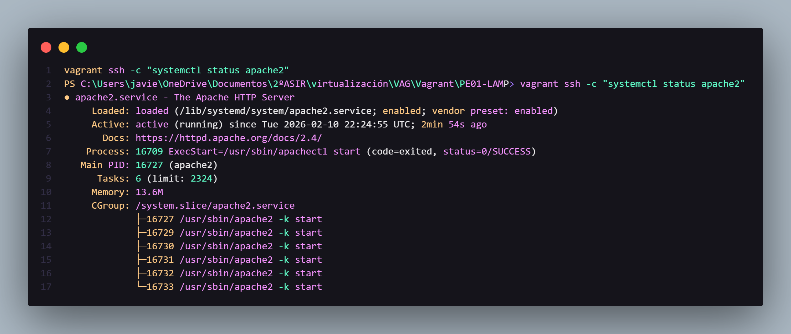
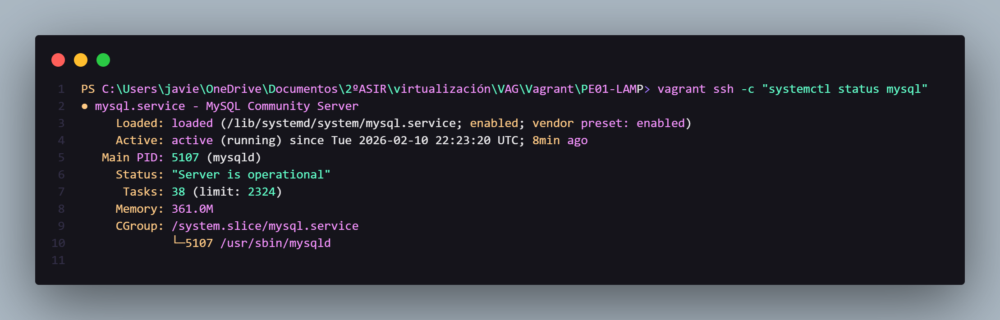
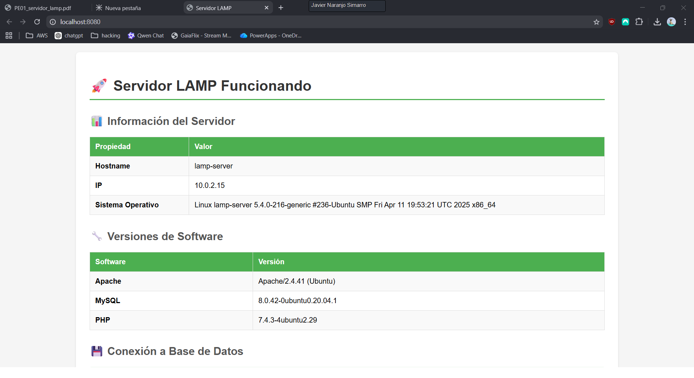
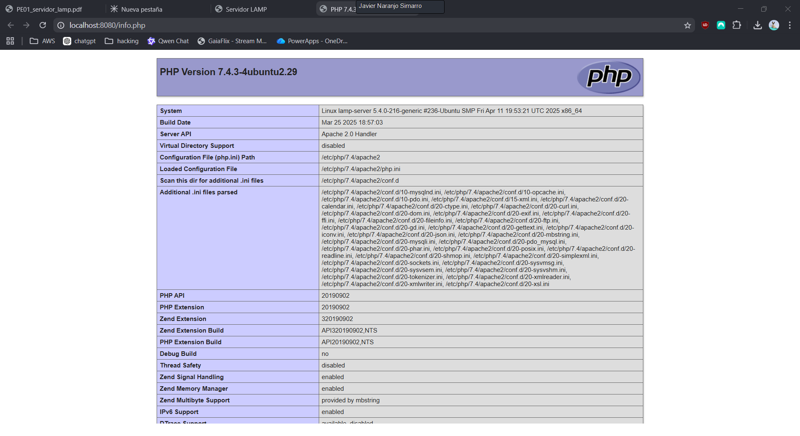

# PE01-LAMP - Servidor Web LAMP


Servidor LAMP (Linux, Apache, MySQL, PHP) completamente automatizado con Vagrant. Este proyecto crea una máquina virtual con Ubuntu que incluye un servidor web Apache, base de datos MySQL y PHP configurados y listos para usar.

## Descripción del proyecto

Este proyecto implementa una infraestructura LAMP completa mediante Vagrant, permitiendo crear un entorno de desarrollo web reproducible y automatizado. La máquina virtual se configura automáticamente con:

- **Linux**: Ubuntu 20.04 (Focal Fossa)
- **Apache**: Servidor web 2.4
- **MySQL**: Base de datos 8.0
- **PHP**: 7.4 o superior con extensiones esenciales

La configuración incluye una aplicación web de prueba que muestra información del servidor, versión del software instalado, estado de conexión a la base de datos y extensiones PHP cargadas.

## Requisitos previos

Antes de comenzar, asegúrate de tener instalado:

- **VirtualBox**: Versión 7.0 o superior
  - Descarga: https://www.virtualbox.org/wiki/Downloads
- **Vagrant**: Versión 2.4 o superior
  - Descarga: https://www.vagrantup.com/downloads
- **Recursos del sistema**:
  - Mínimo 2 GB de RAM libres
  - 5 GB de espacio en disco
  - 2 CPUs disponibles (recomendado)

## Instrucciones de uso

### 1. Clonar o descargar el proyecto

```bash
cd PE01-LAMP
```

### 2. Iniciar la máquina virtual

```bash
vagrant up
```

Este comando descargará la imagen de Ubuntu (si es la primera vez), creará la VM y ejecutará automáticamente los scripts de provisioning para instalar y configurar Apache, MySQL y PHP.


*Proceso de creación y provisioning de la máquina virtual*

### 3. Verificar el estado

Una vez completada la instalación, puedes verificar que los servicios están funcionando:

```bash
# Verificar estado de Apache
vagrant ssh -c "systemctl status apache2"

# Verificar estado de MySQL
vagrant ssh -c "systemctl status mysql"

# Probar conexión a la base de datos
vagrant ssh -c "mysql -u lamp_user -plamp_pass lamp_db -e 'SELECT 1;'"
```

**Verificación de Apache:**



*Estado del servicio Apache verificando que está activo y funcionando*

**Verificación de MySQL:**



*Estado del servicio MySQL verificando que está activo y funcionando*

**Conexión a la base de datos:**


*Prueba de conexión a la base de datos lamp_db con el usuario lamp_user*

### 4. Acceder a la aplicación web

Abre tu navegador y visita:
- **http://localhost:8080** - Página principal con información del servidor
- **http://localhost:8080/info.php** - Página con phpinfo() completo (si está creada)

### 5. Comandos útiles

```bash
# Conectarse por SSH a la VM
vagrant ssh

# Detener la VM (sin destruirla)
vagrant halt

# Reiniciar la VM
vagrant reload

# Destruir la VM (eliminar completamente)
vagrant destroy

# Re-provisionar (ejecutar scripts de nuevo)
vagrant provision
```

## Accesos

### URLs

- **Web (puerto redirigido)**: http://localhost:8080
- **Web (IP privada)**: http://192.168.56.100
- **SSH**: `vagrant ssh` (desde el directorio del proyecto)

### Credenciales

#### MySQL

- **Usuario**: `lamp_user`
- **Contraseña**: `lamp_pass`
- **Base de datos**: `lamp_db`
- **Host**: `localhost`

#### SSH

- **Usuario**: `vagrant`
- **Contraseña**: `vagrant` (o usar clave SSH automática)
- **Acceso**: `vagrant ssh` desde el directorio del proyecto

### Configuración de la VM

- **Hostname**: `lamp-server`
- **IP privada**: `192.168.56.100`
- **RAM**: 2048 MB
- **CPUs**: 2
- **Box**: `ubuntu/focal64`

## Estructura del proyecto

```
PE01-LAMP/
├── Vagrantfile              # Configuración de la VM
├── README.md                # Este archivo
├── scripts/                 # Scripts de provisioning
│   ├── install-apache.sh    # Instalación y configuración de Apache
│   ├── install-mysql.sh     # Instalación y configuración de MySQL
│   └── install-php.sh       # Instalación y configuración de PHP
├── screenshots/             # Capturas de pantalla 
│   ├── vagrant-up.png       # Captura del proceso vagrant up
│   ├── web.png              # Captura de la página principal
│   ├── phpinfo.png          # Captura de phpinfo()
│   ├── ssh-apache2-comprobar.png  # Verificación de Apache
│   ├── ssh-mysql-comprobar.png    # Verificación de MySQL
│   └── ssh-conexion-sql.png       # Conexión a la base de datos
└── www/                     # Contenido web (sincronizado con /var/www/html)
    ├── index.php            # Aplicación web de prueba
    └── info.php             # Página con phpinfo()
```

## Capturas de pantalla

### Aplicación Web

**Página principal del servidor LAMP:**



*Captura de la página principal mostrando información del servidor, versiones de software y estado de conexión a la base de datos.*

**Información PHP (phpinfo):**



*Captura de la página phpinfo() mostrando la configuración completa de PHP.*

## Solución de problemas

### El puerto 8080 está en uso

Si el puerto 8080 ya está ocupado, puedes cambiarlo en el `Vagrantfile`:

```ruby
config.vm.network "forwarded_port", guest: 80, host: 8081
```

Luego ejecuta `vagrant reload`.

### Error al instalar paquetes

Si hay problemas con la instalación, intenta:

```bash
vagrant destroy
vagrant up
```

### La IP privada no funciona

Asegúrate de que VirtualBox tenga configurada la red privada. Puedes verificar con:

```bash
vagrant ssh -c "ip addr show"
```

## Información técnica

### Software instalado

- **Apache 2.4** con módulos rewrite y ssl habilitados
- **MySQL 8.0** con base de datos y usuario preconfigurados
- **PHP 7.4+** con extensiones:
  - php-mysql
  - php-curl
  - php-gd
  - php-mbstring
  - php-xml

### Características

- ✅ Provisioning completamente automatizado
- ✅ IP privada fija configurada (192.168.56.100)
- ✅ Puerto HTTP redirigido (8080 → 80)
- ✅ Base de datos y usuario creados automáticamente
- ✅ Scripts de instalación separados y organizados
- ✅ Carpeta compartida entre host y guest
- ✅ Virtual host personalizado configurado (lamp-server)
- ✅ Aplicación web PHP funcional con información del servidor
- ✅ Página phpinfo() disponible

## Autor

Proyecto realizado para la práctica PE01 - Servidor Web LAMP

Javier Naranjo Simarro

## Licencia

Este proyecto es de uso educativo.
