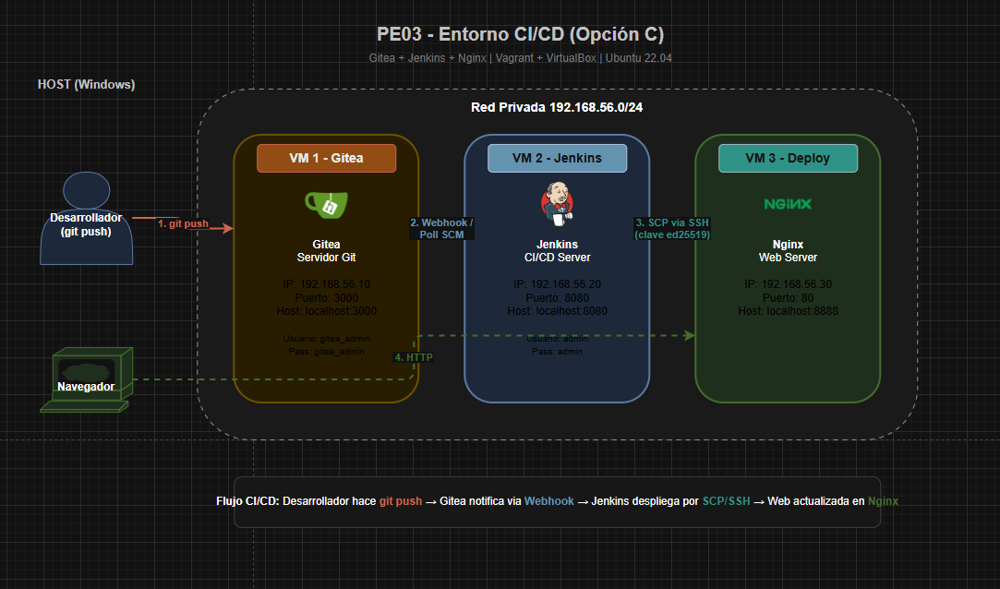

# PE03 - Proyecto Final: Entorno de Integración Continua (CI/CD)

**Opción C** | Virtualización - 2º ASIR

---

## Descripción

Infraestructura DevOps completa con 3 máquinas virtuales que implementan un pipeline de integración y despliegue continuo (CI/CD):

- **Gitea**: Servidor Git con interfaz web (alternativa ligera a GitLab)
- **Jenkins**: Servidor CI/CD que ejecuta pipelines automáticamente
- **Deploy**: Servidor de producción con Nginx donde se despliega la aplicación

Cuando se hace `git push` al repositorio en Gitea, Jenkins detecta el cambio, ejecuta el pipeline y despliega automáticamente la aplicación en el servidor de producción.

---

## Diagrama de Arquitectura


## Máquinas Virtuales

| VM | Hostname | IP | RAM | Puerto Host | Servicio |
|---|---|---|---|---|---|
| Gitea | `gitea` | 192.168.56.10 | 1024 MB | localhost:3000 | Servidor Git |
| Jenkins | `jenkins` | 192.168.56.20 | 2048 MB | localhost:8080 | CI/CD |
| Deploy | `deploy` | 192.168.56.30 | 1024 MB | localhost:8888 | Nginx (web) |

**Box base:** Ubuntu 22.04 LTS (`ubuntu/jammy64`)

---

## Requisitos Previos

- [Vagrant](https://www.vagrantup.com/) ≥ 2.3
- [VirtualBox](https://www.virtualbox.org/) ≥ 7.0
- **RAM mínima:** 8 GB (recomendado 16 GB)
- **Conexión a internet** (para descargar paquetes durante el provisioning)

---

## Inicio Rápido

```bash
# 1. Clonar o descomprimir el proyecto
cd PE03-proyecto_final

# 2. Levantar toda la infraestructura (10-15 min la primera vez)
vagrant up

# 3. Verificar estado de las VMs
vagrant status

# 4. Acceder a los servicios:
#    - Gitea:   http://localhost:3000   (usuario: gitea_admin / gitea_admin)
#    - Jenkins: http://localhost:8080   (usuario: admin / admin)
#    - Web App: http://localhost:8888
```

---

## Estructura del Proyecto

```
PE03-proyecto_final/
├── README.md                    # Este archivo
├── Vagrantfile                  # Configuración principal de Vagrant
├── config.yml                   # Variables externas (IPs, puertos, credenciales)
├── PE03_proyecto_final.pdf      # Enunciado del proyecto
│
├── scripts/                     # Scripts de provisioning
│   ├── common.sh                # Configuración común (hosts, SSH keys, paquetes)
│   ├── gitea.sh                 # Instalación y configuración de Gitea
│   ├── jenkins.sh               # Instalación y configuración de Jenkins
│   ├── deploy.sh                # Instalación y configuración de Nginx
│   └── health-check.sh          # Script de monitorización (bonus)
│
├── config-files/                # Archivos de configuración externos
│   ├── gitea-app.ini            # Configuración de Gitea
│   ├── nginx-deploy.conf        # Configuración de Nginx
│   └── ssh/                     # Claves SSH (se generan automáticamente)
│       ├── jenkins_key          # Clave privada (Jenkins)
│       └── jenkins_key.pub      # Clave pública (Deploy server)
│
└── app/                         # Código de la aplicación web
    └── index.html               # Página web que se despliega
```

---

## Flujo CI/CD

1. **Push**: El desarrollador sube cambios al repositorio `mi-web` en Gitea
2. **Detección**: Jenkins detecta el cambio (Poll SCM cada minuto + webhook)
3. **Pipeline**: Jenkins ejecuta las etapas definidas en el `Jenkinsfile`:
   - **Clonar repositorio**: Descarga el código desde Gitea
   - **Verificar archivos**: Comprueba que `index.html` existe
   - **Desplegar**: Copia `index.html` al servidor Deploy via SCP
   - **Verificar despliegue**: Hace curl al servidor para confirmar
4. **Resultado**: La aplicación actualizada está disponible en el servidor Deploy

---

## Credenciales

| Servicio | Usuario | Contraseña |
|---|---|---|
| Gitea | `gitea_admin` | `gitea_admin` |
| Jenkins | `admin` | `admin` |

> Se pueden modificar en el archivo `config.yml`

---

## Configuración Externa (config.yml)

Todas las variables de configuración están externalizadas en `config.yml`. Esto permite modificar IPs, puertos, RAM y credenciales sin tocar el Vagrantfile ni los scripts:

```yaml
gitea:
  ip: "192.168.56.10"
  ram: 1024
  admin_user: gitea_admin
  # ... etc
```

---

## Demostración de Funcionamiento

### Verificar estado de las VMs
```bash
vagrant status
```

### Acceder por SSH a las máquinas
```bash
vagrant ssh gitea
vagrant ssh jenkins
vagrant ssh deploy
```

### Verificar comunicación entre VMs
```bash
# Desde cualquier VM:
ping -c 3 gitea
ping -c 3 jenkins
ping -c 3 deploy
```

### Probar Gitea (API)
```bash
curl http://192.168.56.10:3000/api/v1/version
curl http://192.168.56.10:3000/api/v1/repos/gitea_admin/mi-web
```

### Probar la web desplegada
```bash
curl http://192.168.56.30
# O desde el host: http://localhost:8888
```

### Ejecutar health check
```bash
vagrant ssh deploy -c "bash /vagrant/scripts/health-check.sh"
```

### Simular un despliegue (modificar código y push)
```bash
# Clonar el repositorio desde Gitea
git clone http://192.168.56.10:3000/gitea_admin/mi-web.git
cd mi-web

# Modificar el index.html
echo "<h1>Nueva versión!</h1>" > index.html

# Subir cambios
git add -A
git commit -m "Actualización de la web"
git push
# (usuario: gitea_admin, contraseña: gitea_admin)

# Esperar ~1 minuto y verificar que Jenkins desplegó automáticamente
curl http://192.168.56.30
```

---

## Troubleshooting

### Las VMs no arrancan
```bash
# Verificar VirtualBox
VBoxManage --version

# Destruir y recrear
vagrant destroy -f
vagrant up
```

### Gitea no responde
```bash
vagrant ssh gitea
sudo systemctl status gitea
sudo journalctl -u gitea --no-pager -n 50
```

### Jenkins no carga
```bash
vagrant ssh jenkins
sudo systemctl status jenkins
sudo journalctl -u jenkins --no-pager -n 50

# Jenkins tarda ~2 minutos en arrancar completamente
```

### El pipeline no se ejecuta
```bash
# Verificar que Jenkins tiene los plugins instalados
# Ir a http://localhost:8080 → Administrar Jenkins → Plugins

# Re-crear el pipeline manualmente si es necesario:
vagrant ssh jenkins
sudo java -jar /tmp/jenkins-cli.jar -s http://localhost:8080/ \
    -auth admin:admin build "deploy-mi-web"
```

### Error de SSH entre Jenkins y Deploy
```bash
# Verificar que la clave SSH existe
vagrant ssh jenkins
ls -la /var/lib/jenkins/.ssh/

# Probar conexión manual
sudo -u jenkins ssh -i /var/lib/jenkins/.ssh/id_ed25519 vagrant@192.168.56.30 'echo OK'
```

### Re-provisionar una VM individual
```bash
vagrant provision gitea
vagrant provision jenkins
vagrant provision deploy
```

---

## Puntos Extra Implementados

| Extra | Descripción |
|---|---|
| **Variables externas** (+0.5) | Configuración en `config.yml` separado |
| **Monitorización** (+0.5) | Script `health-check.sh` que verifica todos los servicios |
| **README excelente** (+0.5) | Este README con diagrama, instrucciones y troubleshooting |

---

## Tecnologías Utilizadas

- **Vagrant** - Gestión de máquinas virtuales
- **VirtualBox** - Hipervisor
- **Ubuntu 22.04 LTS** - Sistema operativo base
- **Gitea** - Servidor Git ligero
- **Jenkins** - Servidor CI/CD
- **Nginx** - Servidor web
- **Shell scripting** - Provisioning automatizado
- **SSH** - Comunicación segura entre VMs

---

## Autor

Javier - 2º ASIR - Virtualización
